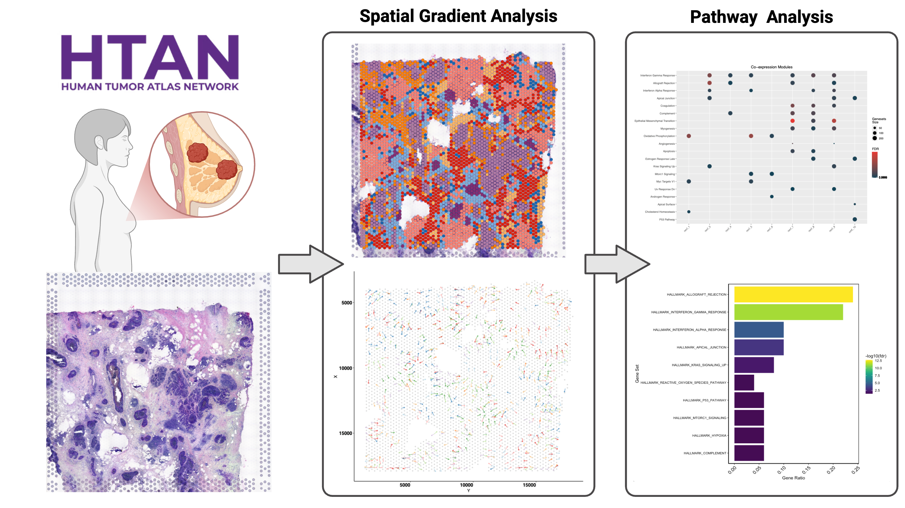
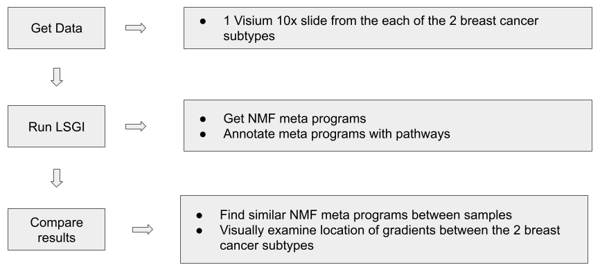
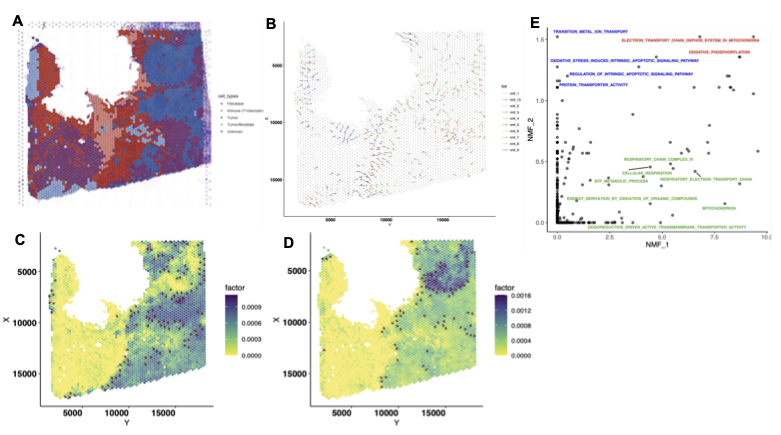

# Transcription Program Gradients
## Human Tumor Atlas Network (HTAN) Data Jamboree | Nov. 6-8, 2024

## HTAN Transcription Program Gradients Team
- **Yukun Tan**, Department of Bioinformatics and Computational Biology, University of Texas MD Anderson Cancer Center, Houston, TX
- **Mary Goldman**, Genomics Institute, UC Santa Cruz, Santa Cruz, CA
- **Minji Kim**, Department of Artificial Intelligence and Informatics Research, Mayo Clinic, Jacksonville FL
- **Irene Marin Goni**, Machine Learning for Computational Biology, CIMA University of Navarra, Spain / MPET Department, Mayo Clinic, Rochester, MN
- **Neel Sanghvi**, Cancer Data Science Laboratory, NCI (NIH), Bethesda, MD
- **Lon Fong**, PRIME-TR, University of Texas MD Anderson Cancer Center, Huston TX
- **Syed Abbas Bukhari**, Laboratory of Pediatric Oncology, NCI (NIH), Bethesda, MD
- **Phi Le**, Department of Medicine, University of California San Francisco, San Francisco, CA

## Overview
Local Spatial Gradient Inference (LSGI) is a tool that systematically identifies spatial locations with prominent, interpretable spatial transcriptomic gradients (STGs) from spatial transcriptomic (ST) data ([Manuscript](https://www.biorxiv.org/content/10.1101/2024.03.19.585725v1), [Github](https://github.com/qingnanl/LSGI)).

We applied LSGI to breast cancer data in HTAN, specifically exploring if transcriptional gradients vary between breast cancer subtypes.

We reanalyzed data from [Iglesia 2024](https://www.nature.com/articles/s43018-024-00773-6), which showed characteristic links in gene expression and chromatin accessibility between breast cancer subtypes. In particular they found exhausted CD8+ T cells were enriched in basal-like breast cancer, suggesting an altered means of immune dysfunction. We hope to verify this exhausted CD8+ T cells in the results from the LSGI algorithm.

## Data Details
Visium 10X data were downloaded from the Human Tumor Atlas Network’s WUSTL atlas (HTAN WUSTL). We examined 6 samples: Basal: HT206B1-S1Fc1U2Z1B1, HT268B1-Th1H3Fc2U12Z1Bs1, HT271B1-S1H3Fc2U1Z1Bs1 Luminal: HT305B1-S1H1Fc2U1Z1Bs1, HT323B1-S1H1Fc2U1Z1Bs1, HT243B1H3A2-S1Fc1U1Z1B1. Here is the [list of synapseIDs](https://github.com/NCI-HTAN-Jamborees/Transcription-Program-Gradients/blob/main/synapseIDs) for all data downloaded.

## Project Description
This project includes follwing R scripts:
1. `spatial_gradient_pipeline.R`
2. `clustering_NMF.R`
3. `run_over_representation_GO.R`
### spatial_gradient_pipeline.R
#### Workflow
1. **Data Preprocessing**
    - Load spatial transcriptomics data from a 10X Genomics dataset.
    - Create a Seurat object for spatial analysis, link to corresponding imaging data, and filter out unwanted features such as ribosomal and mitochondrial genes.
    - Normalize the data to make it suitable for downstream analysis.
2. **Non-negative Matrix Factorization (NMF)**
    - Apply NMF to identify spatial patterns in gene expression data.
    - This step helps reduce dimensionality, making it easier to visualize and interpret the data.
3. **Local Spatial Gradient Inference (LSGI)**
    - Extract spatial coordinates and NMF embeddings.
    - Perform LSGI analysis to infer local spatial gradients, which provides insights into the local relationships between cell populations.
4. **Functional Annotation**
    - Use the hallmark gene sets to functionally annotate the identified NMF factors.
    - Perform hypergeometric tests to enrich for biological pathways.
    - Visualize the results to understand the biological relevance of identified spatial modules.
5. **Visualization**
    - Generate plots for spatial gradients and perform distance heatmap analysis.
    - Create visualizations of the enriched gene sets to understand their biological significance.
#### Input
- **10X Genomics Visium Data**: The input data should include the filtered feature-barcode matrix and the spatial image data for breast cancer samples.
- **Parameters for NMF**: Users can specify the rank for NMF analysis and the tolerance level for optimization.
#### Output
- **Processed Seurat Object**: An RDS file containing the processed Seurat object (e.g.,`HT206B1-S1Fc1U2Z1B1_processed_data.rds`), which includes the spatial transcriptomics data with linked imaging and NMF embeddings.
- **LSGI Results**: An RDS file (e.g.,`HT206B1-S1Fc1U2Z1B1_lsgi.rds`) containing the results from the LSGI analysis.
- **Visualizations**: Plots of the spatial gradients, distance heatmaps, and enriched gene sets saved as PDFs.
- **Functional Annotations**: Excel files containing the hallmark enrichment results (e.g.,`MESO_fov19_Hallmark_hypeR.xlsx`).
#### Requirements
- R version 4.0 or higher
- Required libraries: `Seurat 5.1.0`, `Matrix 1.6-5`, `RcppML 0.3.7`, `ggplot2 3.5.1`, `dplyr 1.1.4`, `LSGI 0.1.0`, `hypeR 2.0.0`, `msigdbr 7.5.1`
### clustering_NMF.R
#### Workflow
1. **Load Data**
    - Load pre-processed Seurat objects from provided .rds files for multiple biological samples.
2. **Feature Extraction**
    - Extract the top features (genes) from NMF feature loadings for each sample. This allows us to identify the most influential genes contributing to each NMF component.
3. **Jaccard Distance Computation**
    - Calculate the Jaccard distance between the top features for different samples. Separate analyses are conducted for basal and luminal subtypes.
4. **Heatmap Visualization**
    - Generate heatmaps to visualize the Jaccard distance matrices for basal and luminal subtypes, as well as between these subtypes.

#### Input
- The script expects pre-processed Seurat objects in `.rds` format 
#### Output
- `heatmap.pdf`: Jaccard distance matrices for basal and luminal subtypes.
- `heatmap_BasalvsLuminal.pdf`: Jaccard distance matrix comparing basal and luminal subtypes.
#### Requirements
- R version 4.0 or higher
- Required libraries: `Seurat 5.1.0`, `Matrix 1.6-5`, `RcppML 0.3.7`, `ggplot2 3.5.1`, `dplyr 1.1.4`, `LSGI 0.1.0`, `hypeR 2.0.0`, `msigdbr 7.5.1`
### run_over_representation_GO.R
#### Worksflow
We load the gene lists of interest and run gene set over representation from GO
#### Input
The list of genes that you want to find the pathway
#### Output
The results of gene set enrichment analysis that has list of gene sets from GO and related outomes.
#### Requirements
Required libraries: `clusterProfilen`, `parallel`, `data.table`, `org.Hs.eg.db` 

## Usage
1. Clone this repository and set the correct working directory.
2. Ensure that all required libraries are installed.
3. Run the script with the input data in the appropriate format.
4. Outputs will be saved in the current directory, including processed data, LSGI results, and visualization plots.

## Results
### Figure 1

LSGI detects intra-tumor heterogeneity, with both shared and distinct functional programs. Panel A shows the distribution of cell types across the tissue. Panel B shows the gradient results (as arrows colored according to NMF) across the tissue. Panels C and D show the contribution of NMFs 1 and 2, respectively. Panel E compares the pathway enrichments of the top genes in NMFs 1 and 2.
By comparing NMF 1 and 2 directly, we can visualize the spatial differences between NMFs, where different regions feature distinct contributions. Meanwhile, enriching these NMFs suggest important spatial immune and metabolic pathways, some conserved (e.g., oxidative phosphorylation) and some distinct (e.g. ETC respiration).

### Figure 2

Differences in immune landscapes between basal and luminal BC as illustrated by differential spatial distribution of gene meta-programs. Spatial distribution of expression levels of gene meta-programs NMF3 in basal BC (A, left) and NMF5 in luminal BC (B, left), along with corresponding cell types in the same tissue section (A and B, middle) and pathway composition analysis of the gene meta-programs (A and B, right).
Immune cell populations (indicated by red arrows in both A and B) showed differences in spatial distribution of meta-programs enriched in pathways involved in immune-cell signaling and functional exhaustion.

### Figure 3

Heatmap (A) indicating similarity between  gene meta-programs (NMFs) of luminal and basal BC subtypes in terms of pathway composition. The cell in the red box indicates a comparison between NMFs in basal and luminal, with the pathway composition of the two NMFs given in (B). The NMF of the basal subtype shows an enrichment in hormonal signaling, while that of the luminal subtype shows an enrichment in metabolic dysregulation.

### Wireframes
We created wireframes using the tool [Balsamiq](https://balsamiq.com/) to show how a user could explore the results from this project. The PDF and .bmpr file (Balsamiq-specific file) are in the wireframes directory.

Here is a screenshot from the wireframes:

## Future features
- Include more spatial-specific analyses, such as quantitative association of gradients with other spatial features.
- Test different parameters for LSGI, such as whether 10 is the optimal number of NMFs as well as the window size and number of anchors.
- Assess clinical relevance of LSGI outputs, such as recapitulation of prognostic subtypes found in the paper using gradients

## License
This project is licensed under the MIT License. See the [LICENSE](https://github.com/NCI-HTAN-Jamborees/Transcription-Program-Gradients/blob/main/LICENSE) file for more details.

## Acknowledgements
Thank you to the Human Tumor Atlas Network (HTAN), NIH, NCI, ISB-CGC and Cancer Genomics Cloud (Seven Bridges) for all support.

Funding resources:
PACT-CIMAC-CIDC Network 
U24CA224285 to Cara Haymaker, Ignacio I. Wistuba, and Gheath al-Atrash
NIH ITCR grant U01CA247760 and Chan-Zuckerberg Initiative grants 2024-345892 to Ken Chen

